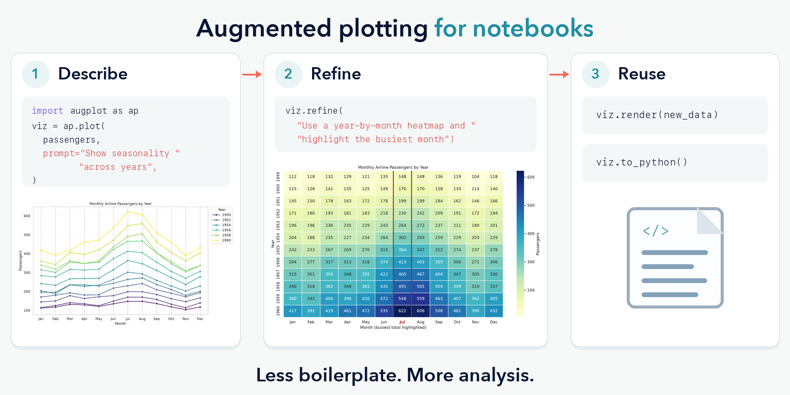

# Augplot



Pass Augplot your notebook data and describe what you want to see. Refine the
visualization in plain language, then reuse or export the generated Matplotlib or
Seaborn code.

## Quick start

Augplot supports Python 3.11 through 3.14.

```bash
pip install augplot
```

Configure a supported model and its provider credentials:

```bash
export AUGPLOT_MODEL="openai/YOUR_MODEL_ID"
export OPENAI_API_KEY="..."
```

Then work directly with data already in your notebook:

```python
import augplot as ap

flights = ap.load_sns_dataset("flights")
viz = ap.plot(
    flights,
    prompt="Plot monthly airline passengers over time, with one line per year.",
)
viz.refine(
    "Turn this into a year-by-month heatmap and highlight the busiest month."
)
viz.to_python(function_name="plot_monthly_passengers")
```

Open or download the [example notebook](examples/quickstart.ipynb) to try the complete
workflow.

## Workflow

- `plot()` generates the initial visualization.
- `refine()` revises the current version and can be repeated.
- `render()` applies the current visualization to compatible data without a model call.
- `to_python()` exports the current version as standalone Matplotlib or Seaborn code.

Only `plot()` and `refine()` may call the configured model. Reuse and export stay local:

```python
viz.render(new_data)
viz.figure.savefig("passengers.png", dpi=300)
viz.to_python(function_name="plot_monthly_passengers")
```

Inspect the current implementation with `viz.code`. The exported module needs neither
Augplot nor provider credentials.

## Configuration

Pass options directly to `ap.plot()`:

```python
viz = ap.plot(
    data,
    backend="seaborn",       # auto, matplotlib, or seaborn
    display_format="retina", # retina, png, or svg
    show=True,
)
```

See the [API and workflow reference](docs/api.md) for all `ap.plot()` options and
inspectable attributes.

Use `AUGPLOT_MODEL` for the model and `AUGPLOT_API_BASE` for a custom endpoint. Providers
use the credentials expected by LiteLLM. The configured model must support strict JSON
Schema responses and be recognized as such by LiteLLM; unsupported combinations raise
`ConfigurationError` before inference.

## History

Generated and refined plots are saved in `.augplot/plots`. Matching steps replay without
another model call. Use `regenerate=True` to request new code or `cache_dir=None` to
disable persistence. See [visualization history](docs/visualization-history.md) for the
replay rules.

## Data and generated code

Augplot sends the configured model a bounded profile of your data, including samples,
field names, and statistics. This is not anonymization; `sample_rows=0` omits samples but
not all schema or summary information.

Generated Python is validated, then runs locally against a copy of the data. Rejected
code never runs or saves. This is defense in depth, not an OS sandbox. See
[generated-code guardrails](docs/generated-code-guardrails.md).

Augplot visualizes supplied data only. It can compute plot-related summaries and trends,
but does not train models or return predictions, forecasts, or other analytical artifacts.

## Beta and security

Augplot 0.1.0 is a beta release; APIs and saved-history formats may change before 1.0.
Review generated code before sensitive or security-critical use, and report
vulnerabilities through the [security policy](SECURITY.md).

## License

Augplot is licensed under the [Apache License 2.0](LICENSE).

## Development

```bash
python -m pip install -e '.[dev]'
python -m pytest
python -m ruff check .
python -m build
```
